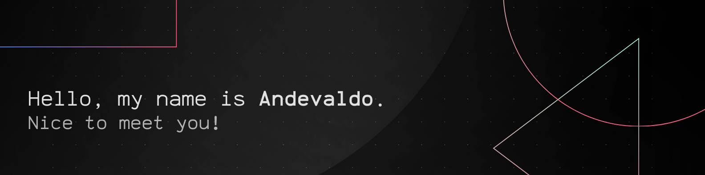

  
  

Software developer and researcher, Master's student in Electrical Engineering (UFAM), with a background in Computer Engineering.

- 🔍 **Researcher in Nonlinear Dynamical Systems**, focusing on modeling and stability.
- 🎓 **Event-Based Control Techniques**.
- 👨‍💻 **Web Developer** (React, Angular, JavaScript).
- 📱 **Android Developer** (Java, Kotlin).
- 🛠️ **Dev Tools**: Git, Docker, CI/CD.
- 🌐 Interested in AI and machine learning.
- 📚 Mentor in programming and development.
- 🎹 Pianist and keyboardist.

  <h3>My Stats</h3>
   
  

  <h3>GitHub Streak</h3>
  

